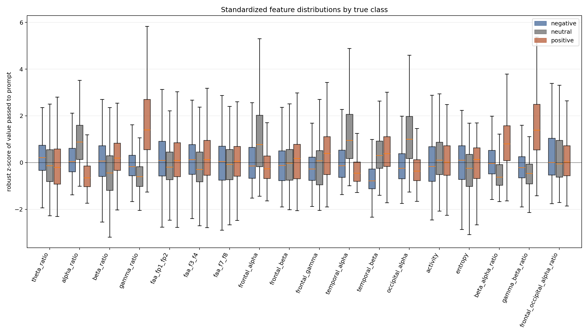
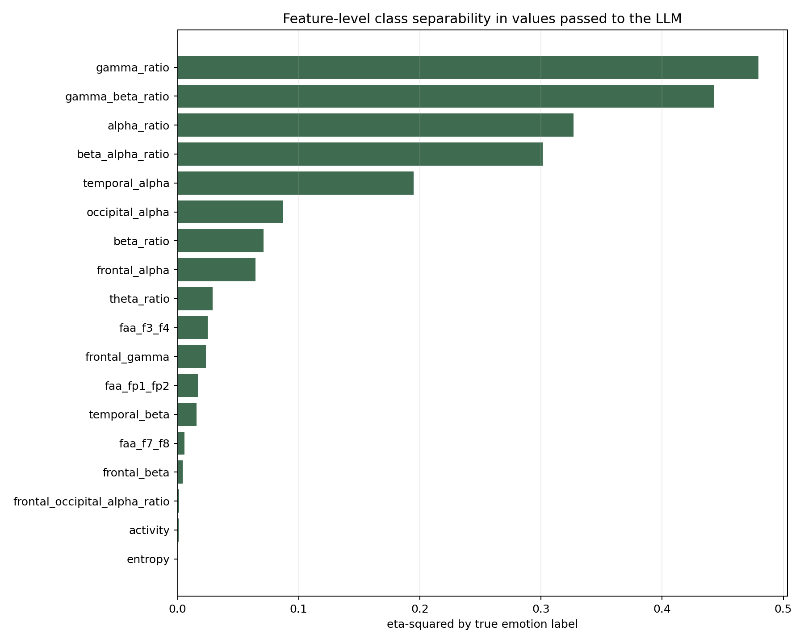
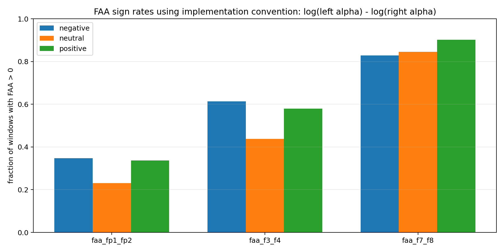
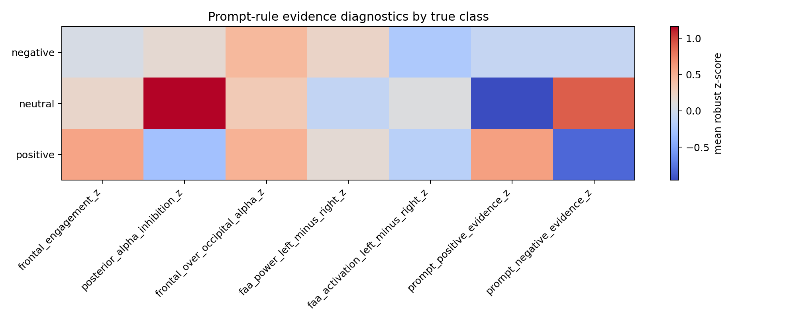

# Exploring Brain Signals and Affective Computing for Neuromarketing

## Overview

This project explores the intersection of EEG signal processing, machine learning, and deep learning to understand emotional responses and affective states through brain signals. The project focuses on emotion classification using the SEED dataset, employing both classical machine learning algorithms and advanced deep learning architectures.

The goal is to develop robust models for emotion recognition from EEG signals, with applications in neuromarketing research, user experience optimization, and affective computing. And as a part of the project, it was a goal to assess for llm perfromance in emotion classification.

## Table of Contents

- [Project Structure](#project-structure)
- [Installation](#installation)
- [Datasets](#datasets)
- [Features](#features)
- [Usage](#usage)
- [Models](#models)
- [Configuration](#configuration)
- [Results](#results)
- [References](#references)

## Project Structure

```
.
├── data/                          # Dataset storage
│   └── SEED_EEG/                  # SEED dataset
│       └── SEED_EEG/
│           ├── ExtractedFeatures_1s/      # Pre-extracted features (1-second windows)
│           ├── ExtractedFeatures_4s/      # Pre-extracted features (4-second windows)
│           ├── Preprocessed_EEG/          # Preprocessed raw EEG data
│           ├── SEED_RAW_EEG/              # Raw EEG signals
│           └── subject-id-gender-seed.txt # Subject metadata
├── model/                         # Trained model checkpoints and results
│   ├── deep_experiment/           # Deep learning model weights
│   │   ├── cnn_attention_best.pt
│   │   ├── cnn_lstm_best.pt
│   │   ├── deep4net_best.pt
│   │   ├── eegconformer_best.pt
│   │   ├── eegnet_best.pt
│   │   ├── lstm_best.pt
│   │   ├── shallowconv_best.pt
│   │   └── tcn_best.pt
│   ├── extra_trees/               # Ensemble model results
│   ├── logistic_regression/       # Linear model results
│   ├── random_forest/             # Random forest model results
│   ├── sgd_clf/                   # SGD classifier results
│   ├── xgboost/                   # XGBoost model results
│   ├── benchmark_summary.json     # Overall benchmark results
│   └── deep_results.json          # Deep learning results summary
├── output/                        # Benchmark and inference results
│   └── benchmark_inference_*.json
├── prompt/                        # Prompt used for llm inference 
├── src/                           # Source code modules
│   ├── benchmark.py               # Model benchmarking
│   ├── config.py                  # Configuration settings
│   ├── feature_extraction.py      # EEG feature extraction
│   ├── llm_inference.py           # LLM-based inference
│   ├── llm_training.py            # LLM model training
│   ├── model_registry.py          # Model registry and factory
│   ├── preprocessing.py           # EEG signal preprocessing
│   ├── seed_loader.py             # SEED dataset loader
│   ├── tokenization.py            # Sequence tokenization
│   ├── train_baselines.py         # Baseline model training
│   └── train_deep_models.py       # Deep learning model training
├── tests/                         # Unit tests
│   ├── test_feature_extraction.py
│   ├── test_llm_inference.py
│   ├── test_preprocessing.py
│   └── test_seed_loader.py
├── requirements.txt               # Python dependencies
└── README.md                      # This file
```

## Installation

### Prerequisites

- Python 3.8 or higher
- pip or conda package manager
- Git for version control

### Setup Instructions

1. **Clone the repository:**
   ```bash
   git clone https://github.com/Kingflow-23/Exploring-Brain-Signals-and-Affective-Computing-for-Neuromarketing.git
   cd Exploring-Brain-Signals-and-Affective-Computing-for-Neuromarketing
   ```

2. **Create a virtual environment (recommended):**
   ```bash
   python -m venv venv
   
   # On Windows:
   venv\Scripts\activate
   
   # On macOS/Linux:
   source venv/bin/activate
   ```

3. **Install dependencies:**
   ```bash
   pip install -r requirements.txt
   ```

### Dependencies

- **torch**: Deep learning framework
- **scipy**: Scientific computing
- **numpy**: Numerical computations
- **pandas**: Data manipulation and analysis
- **sklearn**: Machine learning algorithms
- **braindecode**: EEG-specific deep learning toolkit

## Datasets

### SEED Dataset

The project primarily uses the SEED dataset, which contains:

- **15 subjects** with multiple sessions
- **3 emotion classes**: Positive, Negative, Neutral
- **15 trials** per subject per session
- **62 EEG channels** (10-20 International System)
- **Sampling rate**: 200 Hz
- **Pre-processed and raw data** available

#### Data Organization:

- `Preprocessed_EEG/`: Cleaned and preprocessed EEG signals
- `ExtractedFeatures_1s/`: Features extracted with 1-second windows
- `ExtractedFeatures_4s/`: Features extracted with 4-second windows
- `SEED_RAW_EEG/`: Original raw EEG recordings

### Additional Datasets

- **DEAP Dataset** : For a more marketing approach. It was not used for this project but in another interesting one that can be found **[here](https://github.com/vsx23733/AI-CLINIC)**

## Features

### Preprocessing
- Signal filtering and noise removal
- Artifact detection and handling
- Normalization and standardization
- Windowing and feature extraction

### Feature Extraction
- Statistical features (mean, variance, skewness, kurtosis)
- Frequency domain features (power spectral density, bandpower)
- Time-frequency features (wavelet transforms)
- Deep learning embeddings

### Models Implemented

#### Classical Machine Learning
- Logistic Regression
- Random Forest
- Extra Trees
- XGBoost
- SGD Classifier

#### Deep Learning
- Convolutional Neural Networks (CNN)
- Long Short-Term Memory (LSTM)
- Bidirectional LSTM (BiLSTM)
- Gated Recurrent Unit (GRU)
- Attention-based CNN
- EEG-specific architectures (EEGNet, Deep4Net, EEGConformer)
- Temporal Convolutional Networks (TCN)
- Autoencoders and Transformers

#### LLM
As a part of our project, we had to assess the llm performance in emotion prediction. To do that we used a local qwen model: "qwen/qwen3.6-35b-a3b" 

## Usage

### Configuration

Edit `src/config.py` to customize:
- Dataset paths
- Preprocessing window sizes
- Model hyperparameters
- Training parameters
- Emotion labels and mappings

### Training Models

#### Train Classical ML Models
```bash
python src/train_baselines.py
```

#### Train Deep Learning Models
```bash
python src/train_deep_models.py
```

#### Benchmark All Models

After configuring the test dataset, run:

```bash
python src/benchmark.py
```

### Feature Extraction

Extract features from EEG signals:
```python
from src.feature_extraction import extract_features
features = extract_features(eeg_signal)
```

### EEG Data Loading

Load SEED dataset:
```python
from src.seed_loader import SEEDLoader
loader = SEEDLoader()
data = loader.load_subject(subject_id=1)
```

### LLM Inference

Perform inference with LLM models:
```bash
python src/llm_inference.py
```

### LLM Feature Distribution Analysis

Analyze the exact EEG feature values passed to the LLM prompt:

```bash
python src/llm_feature_distribution_analysis.py
```

This generates the report and figures in `output/llm_feature_distribution_analysis/`.

## Models

### Model Registry

All DL models are registered in `src/model_registry.py` for easy access and standardized training/evaluation.

### Trained Weights

Pre-trained model weights are available in `model/deep_experiment/`:
- `cnn_attention_best.pt`: CNN with attention mechanism
- `eegnet_best.pt`: EEGNet architecture
- `deep4net_best.pt`: Deep4Net architecture
- `lstm_best.pt`: Standard LSTM
- `cnn_lstm_best.pt`: CNN-LSTM hybrid
- `tcn_best.pt`: Temporal Convolutional Network
- And more...

## Configuration

### Key Configuration Parameters (src/config.py)

```python
# Preprocessing
WINDOW_SIZE = 450           # Primary window size
ML_WINDOW_SIZE = 800        # ML model window
LLM_WINDOW_SIZE = 1000      # LLM model window

# Dataset
N_TRIALS = 15               # Trials per subject
LABEL_FILE = "label.mat"    # Label file name

# Training
RANDOM_SEED = 42            # For reproducibility
BATCH_SIZE = 32             # Training batch size
EPOCHS = 100                # Training epochs
```

For complete configuration options, see `src/config.py`.

## Results

### Benchmark Artifacts

All experimental outputs are stored in the repository:

- `model/benchmark_summary.json`: global performance summary across models
- `model/deep_results.json`: deep learning evaluation results
- `model/*/metrics.json`: per-model metrics (accuracy, F1-score, precision, recall)
- `model/*/confusion.npy`: confusion matrices for error analysis
- `output/benchmark_inference_*.json`: timestamped inference logs
- `output/llm_feature_distribution_analysis/`: feature-distribution audit of the values passed to the LLM, including plots and discussion notes

---

### Overall Performance Summary

The benchmark evaluates **classical ML models**, **deep learning architectures**, and a **Large Language Model (LLM)** on the SEED EEG emotion recognition dataset using a **3-class classification task**:

- Negative
- Neutral
- Positive

---

### Classical Machine Learning Results

| Model | Window Accuracy | Trial Accuracy |
|------|------|------|
| Logistic Regression | **62.83%** | **66.67%** |
| XGBoost | 60.88% | 60.00% |
| Random Forest | 60.05% | 60.00% |
| Extra Trees | 59.05% | 57.78% |
| SGD Classifier | 58.81% | 55.56% |

**Key insight:**
- Logistic Regression is the strongest baseline
- Indicates that EEG features are partially **linearly separable after preprocessing**
- Tree-based methods show class bias toward **Positive emotion**

---

### Deep Learning Results

| Model | Window Accuracy | Trial Accuracy |
|------|------|------|
| LSTM | **63.70%** | **71.11%** |
| TCN | 60.40% | **71.11%** |
| EEGNet | 56.78% | 53.33% |
| Deep4Net | 55.07% | 55.56% |
| ShallowConvNet | 56.65% | 60.00% |
| EEGConformer | 56.57% | 55.56% |
| CNN-Attention | 55.12% | 55.56% |
| CNN-LSTM | 51.28% | 51.11% |

**Key insight:**
- Temporal architectures (**LSTM, TCN**) outperform convolution-only models
- Performance saturates around **~71% trial accuracy**
- No architecture significantly breaks this ceiling

---

### LLM-Based Classification (Qwen3.6-35B-A3B)

| Model | Window Accuracy | Trial Accuracy |
|------|------|------|
| Qwen3.6-35B-A3B | **38.11%** | **44.44%** |

**Key insight:**
- Strong underperformance compared to supervised models
- Indicates that **LLMs are not suitable for raw EEG feature reasoning without task-specific training or fine-tuning**

---

## Performance Analysis

### 1. Class Structure and Separability

Across all models, a consistent pattern emerges:

- **Positive emotion → highest recall**
- **Negative emotion → moderate confusion**
- **Neutral emotion → highest ambiguity**

This suggests:

> The Neutral class behaves as a **transition manifold** between Positive and Negative states rather than a strictly separable class.

---

### 2. Why Logistic Regression Performs Surprisingly Well

Logistic Regression remains competitive because:

- EEG features are heavily engineered (spectral + asymmetry + entropy)
- Decision boundaries are approximately linear in transformed space
- Noise is reduced through preprocessing and window averaging

---

### 3. Deep Learning Performance Ceiling (~70%)

Despite increased model complexity, deep architectures converge around:

- **~63–64% window accuracy**
- **~71% trial accuracy**

This ceiling is primarily due to:

- strong inter-subject variability
- limited dataset size (15 subjects)
- loss of spatial EEG structure after feature extraction
- redundancy across temporal windows

> Result: models learn temporal smoothing rather than richer discriminative structure.

---

### 4. LLM Failure Mode

The LLM underperformed primarily because of a structural mismatch between the nature of EEG data and the reasoning capabilities of a general-purpose language model.

The model received input in the form of normalized scalar EEG features, such as spectral band ratios, frontal asymmetry indices, entropy, and derived statistical measures. While these features are meaningful from a signal-processing perspective, they remove much of the original information contained in raw EEG recordings.

More specifically, the LLM was missing three critical forms of information:

Spatial topology: the relationships between EEG channels and brain regions
Temporal continuity: how activity evolves over time across windows
Neurophysiological inductive bias: prior knowledge about EEG dynamics and emotional processing

Without these components, the LLM effectively treated the EEG features as generic numerical tokens rather than structured neurophysiological signals.

#### **Preliminary Manual Analysis**

<details>
<summary>Earlier exploratory notes, superseded by the distribution audit below</summary>

The more complete and reproducible version of this analysis is now provided in the updated LLM feature-distribution section below.

To better understand this failure, I manually inspected the feature values passed to the model in output/window_analysis/Values.txt.

One major observation was that the feature distributions did not exhibit strong or consistent separability across emotion classes. Even after experimenting with different window sizes, the distributions remained highly overlapping. Although changing the window size slightly altered the spread of some features, it did not produce clearer class boundaries between Negative, Neutral, and Positive emotions.

Among all extracted features, the one that appeared most meaningful to me was Frontal Alpha Asymmetry (FAA).

FAA is often discussed in neuroscience literature as being correlated with emotional valence:

- more positive FAA → often associated with positive affect or approach behavior
- more negative FAA → often associated with negative affect or withdrawal behavior

During manual inspection, FAA seemed to follow this pattern in some individual trials:

- negative videos often produced more negative FAA values
- positive videos often produced more positive FAA values

However, this pattern did not generalize well across the full test dataset. 

The updated distribution audit shows that FAA should not be interpreted as a simple standalone explanation for over-prediction, because the FAA features have weak global class separability and require careful sign-convention handling.

There are several possible explanations for this.

First, EEG signals are highly subject-dependent. Brain activity varies substantially between individuals due to anatomical differences, baseline neural patterns, attention level, fatigue, stress, and many other factors. A feature that appears meaningful for one subject may become noisy or unreliable for another.

Second, the issue may lie in the interpretation of the feature itself.

Some EEG-derived features especially spectral band powers (theta, alpha, beta, gamma) can often be interpreted using relatively established frameworks such as:

- cortical activation
- attention
- relaxation
- cognitive load

FAA, however, is more delicate. While often associated with valence, its interpretation is far from universal and depends heavily on:

- preprocessing quality
- artifact removal
- referencing strategy
- frequency-band selection
- exact channel selection

Because FAA did not show the expected global distribution in this project, one possibility is that there may be issues in the preprocessing pipeline, especially in the steps involved in computing asymmetry features.

I cannot conclude this with certainty, since I am not a neuroscientist and my expertise in EEG interpretation remains limited. A more informed researcher with stronger domain knowledge in affective neuroscience would likely be better positioned to investigate whether:

- the feature extraction pipeline is optimal
- the preprocessing introduced distortions
- or the SEED dataset itself simply does not support strong FAA-based separation under this setup

It is also possible that with a more robust preprocessing pipeline especially one that removes artifacts more aggressively and preserves meaningful regional activity an LLM-based classifier could perform better.

**What Would Be Needed for Better LLM Performance?**

To push this research further, the first requirement would be identifying more deterministic and discriminative EEG features.

The current feature set appears too ambiguous for zero-shot reasoning.

Future work may require:

- stronger feature selection
- better signal denoising
- improved artifact rejection
- features with clearer emotion-class separability
- prompt engineering specifically tailored to subtle EEG changes

A carefully engineered prompt might help an LLM reason better about nuanced changes in EEG features.

However, this leads to a more fundamental question:

**Is an LLM Even Relevant for This Task?**

This is where I became skeptical.

If using an LLM requires me to:

- deeply preprocess EEG signals
- engineer discriminative features manually
- select the best subset of features
- carefully design a highly specialized prompt
- potentially repeat this pipeline whenever new subjects are introduced

then the practical value of using an LLM becomes questionable.

In an ideal scenario, the LLM would reason directly from raw EEG windows or minimally processed signals and discover meaningful structure on its own.

That was initially the goal.

However, based on the experiments conducted here, this approach did not work.

As a result, if extensive feature engineering remains necessary, then it becomes difficult to justify the use of an LLM over traditional machine learning or deep learning approaches.

A supervised ML model can already:

- learn feature importance automatically
- optimize class boundaries directly
- adapt weights based on data
- outperform the LLM by a large margin

Therefore, if heavy engineering is unavoidable, it is more efficient to let specialized ML or DL models handle the classification.

**Final Conclusion**

The failure of the LLM in this project does not necessarily mean LLMs can never be used for EEG analysis.

Rather, it suggests that current general-purpose LLMs are poorly suited for direct EEG emotion classification without significant domain adaptation.

Consequently:

> The model treats EEG signals as generic numerical tokens, lacking inductive bias for neurophysiological patterns.

</details>

---

## Updated LLM Feature Distribution Analysis

After the first LLM benchmark, I added a dedicated analysis of the numerical values that were actually passed to the LLM prompt. This is important because the LLM was not given raw EEG signals. It received a compact, text-formatted representation of each EEG window through 18 scalar features: spectral ratios, frontal asymmetry values, regional band-power estimates, entropy/activity measures, and derived ratios.

The full generated report is available here:

- `src/llm_feature_distribution_analysis.py`
- `output/llm_feature_distribution_analysis/README.md`
- `output/llm_feature_distribution_analysis/llm_prompt_feature_values.csv`
- `output/llm_feature_distribution_analysis/feature_distribution_summary.csv`

The audit covers **4,017 LLM prompt windows** from the held-out test set:

- negative: **1,323 windows**
- neutral: **1,308 windows**
- positive: **1,386 windows**
- LLM window size: **1000 samples**
- LLM step size: **500 samples**

### What the LLM Actually Did

The Qwen-based LLM reached only **38.11% window accuracy** and **44.44% trial accuracy**. The trial-level prediction distribution reveals the most important failure mode:

| Predicted class | Number of trials | Share |
|------|------:|------:|
| Negative | 0 | 0.0% |
| Neutral | 34 | 75.6% |
| Positive | 11 | 24.4% |

The LLM did not simply confuse two classes. It almost completely failed to recover the negative class. This makes the feature-distribution analysis essential: if the prompt says that certain EEG patterns should indicate negative emotion, but the actual feature values do not form a clean negative pattern, the model has no reliable basis for following that logic.

### Feature Distribution Implication



The standardized distribution plot shows that most values passed to the LLM overlap across negative, neutral, and positive windows. This is the key reason the LLM task is difficult. The prompt describes neuroscience-inspired rules, but the numerical evidence does not behave like a simple rule table.

Some features do carry useful class information:

| Feature | Interpretation | Eta-squared |
|------|------|------:|
| `gamma_ratio` | Global high-frequency activity | 0.4796 |
| `gamma_beta_ratio` | Relative gamma dominance over beta | 0.4431 |
| `alpha_ratio` | Global alpha proportion | 0.3269 |
| `beta_alpha_ratio` | Relative beta dominance over alpha | 0.3013 |
| `temporal_alpha` | Temporal alpha power | 0.1950 |
| `occipital_alpha` | Posterior alpha activity | 0.0869 |



The implication is subtle but important: the features are not meaningless, but their information is statistical rather than directly symbolic. A supervised model can learn that statistical structure from examples. A zero-shot LLM only receives isolated numbers and prompt instructions, so it cannot reliably infer the correct dataset-specific decision boundary.

### FAA and the Sign-Convention Problem

Frontal Alpha Asymmetry (FAA) was especially important to inspect because it is often associated with emotional valence and approach-withdrawal behavior. However, the implementation uses this convention:

```text
FAA = log(left alpha power) - log(right alpha power)
```

This must be interpreted carefully. Alpha power is often treated as inversely related to cortical activation. Therefore, a positive FAA value in this implementation means stronger left alpha power relative to right alpha power. It does not automatically mean stronger left frontal activation.



The FAA values did not strongly separate the classes:

| FAA feature | Eta-squared | Negative median | Neutral median | Positive median |
|------|------:|------:|------:|------:|
| `faa_f3_f4` | 0.0248 | 0.1837 | -0.1317 | 0.1836 |
| `faa_fp1_fp2` | 0.0169 | -0.0835 | -0.1410 | -0.0845 |
| `faa_f7_f8` | 0.0056 | 0.8525 | 0.7681 | 0.8603 |

This weakens a simple explanation such as "left dominance produces positive emotion." In this project, FAA cannot be used as a clean standalone argument for the LLM behavior. It may still be a meaningful EEG feature, but only if the preprocessing, reference scheme, channel selection, alpha-band definition, and sign convention are handled very explicitly.

### Prompt-Rule Diagnostics

The prompt expected positive emotion to be associated with stronger frontal engagement, stronger gamma-related activity, and weaker posterior inhibition. To test this, the analysis built diagnostic scores from standardized feature groups.



The prompt-positive evidence score was:

- negative windows: **-0.078**
- neutral windows: **-0.956**
- positive windows: **0.591**

Positive windows do show stronger positive evidence on average, which is encouraging. However, negative windows are not strongly separated in the opposite direction, and neutral windows are not simply centered between negative and positive. This explains why the LLM did not behave like a clean neuroscience rule engine. The prompt asked for structured reasoning, but the feature distributions did not provide a stable structure for that reasoning.

### Updated LLM Conclusion

The LLM result should be interpreted as a failure of **zero-shot symbolic EEG reasoning**, not as proof that EEG contains no emotion-related information.

The supervised models performed better because they were trained to learn empirical class boundaries. Logistic Regression, LSTM, and TCN do not require every feature to follow a perfectly interpretable rule. They only need consistent statistical structure. The LLM, by contrast, was expected to apply general natural-language knowledge to uncalibrated EEG feature values.

This leads to the main conclusion:

> A general-purpose LLM is not well suited for EEG emotion classification when it receives only scalar EEG summaries and is expected to infer neurophysiological class boundaries from prompt text alone.

For an LLM-based EEG classifier to become more convincing, it would likely need:

- task-specific calibration or fine-tuning
- explicit dataset-level normalization statistics
- corrected and carefully explained FAA sign conventions
- stronger feature selection based on class separability
- spatial and temporal EEG representations rather than isolated scalar summaries
- tool-assisted reasoning over distributions, not only single-window prompt values

In this setup, the LLM is more useful as an interpretability and reporting assistant than as the primary classifier. If extensive feature engineering and statistical calibration are required, classical ML and deep learning remain more appropriate for the classification task itself.

---

## Key Takeaway

Across all model families:

> Performance is primarily constrained by **feature separability**, not model capacity.

This explains why:

- classical ML is competitive
- deep learning does not significantly outperform baselines
- LLMs fail entirely in zero-shot setting

---

## Authors

- [**Florian HOUNKPATIN**](https://www.linkedin.com/in/florian-hounkpatin/)
- [**Noémi DOMBOU**](https://www.linkedin.com/in/noemi-dombou/)
- [**Axel ONOBIONO**](https://www.linkedin.com/in/axel-onobiono/)
- [**Ephraim KOSSONOU**](https://www.linkedin.com/in/ephraïm-kossonou/)

---

## References

- Investigating Critical Frequency Bands and Channels for EEG-based Emotion Recognition with Deep Neural Networks", Wei-Long Zheng, and Bao-Liang Lu, IEEE Transactions on Autonomous Mental Development (IEEE TAMD), 2015.


---

**Last Updated**: June 28, 2026
